# AllerGuard 📱  
**Smart Allergen Detection & Warning App**

AllerGuard is a mobile application that helps users manage food allergies by scanning product barcodes and instantly checking allergen information.  
Users can save their personal allergens, receive real-time warnings, and access detailed allergen information to make safer shopping decisions.

---

## 📌 Table of Contents  
- [About the Project](#-about-the-project)  
- [Features](#-features)  
- [Technologies Used](#-technologies-used)  
- [Installation](#-installation)  
- [How It Works](#-how-it-works)  
- [Screenshots](#-screenshots)  
- [Testing & Security](#-testing--security)  
- [Contact](#-contact)

---

## 🧩 About the Project  

AllerGuard was developed to make grocery shopping safer and easier for people with food allergies.  
By scanning a product barcode, users can immediately access allergen information without having to manually read labels.

**Key Objectives**  
- Provide an **instant allergen detection** system  
- Enable **personal allergen management**  
- Prevent **anaphylactic reactions** with early warnings  
- Offer **educational resources** through FAQs and news updates  

---

## 🚀 Features  

- **Barcode Scanning** → Instantly check product allergen information  
- **Personalized Allergen Management** → Add, edit, and manage allergens  
- **Real-Time Warnings** → Get instant alerts when a scanned product contains allergens  
- **Detailed Allergen Info** → Access comprehensive allergen details and FAQs  
- **Educational Resources** → Stay updated with trusted food allergy news  
- **User Profiles** → Manage your account, saved allergens, and preferences  
- **Secure Authentication** → Firebase-based login, signup, and guest mode  

---

## 🛠️ Technologies Used  

- **Framework:** Ionic + Angular  
- **Backend & Database:** Firebase Firestore  
- **Authentication:** Firebase Auth  
- **API Integration:** [OpenFoodFacts API](https://world.openfoodfacts.org/)  
    - Used to retrieve **real-time product and allergen information** by scanning barcodes.  
    - If a scanned product contains allergens matching the user profile, the app triggers an **instant warning**.  
- **IDE:** Visual Studio Code  
- **Version Control:** Git & GitHub  

---

## ⚡ Installation  

```bash
# Clone the repository
git clone https://github.com/your-username/AllerGuard.git

# Navigate to the project folder
cd AllerGuard

# Install dependencies
npm install

# Configure Firebase
# Update environment.ts with your Firebase credentials

# Run the app
ionic serve

```

## 🔄 How It Works  

1. **Sign Up / Sign In** → Create an account or continue as a guest.  
2. **Add Allergens** → Save allergens you want to avoid.  
3. **Scan Barcode** → Use your camera to scan the product’s barcode.  
4. **Fetch Data via OpenFoodFacts API** →  
   The app automatically retrieves **product and allergen data** from the OpenFoodFacts API.  
5. **Instant Warnings** → If allergens are detected, a **real-time alert** is displayed.  
6. **Read News & FAQs** → Access up-to-date information and educational resources.  

---

## 📷 Screenshots

### **Authentication Screens**
| Login | Register |
|-------|---------|
| 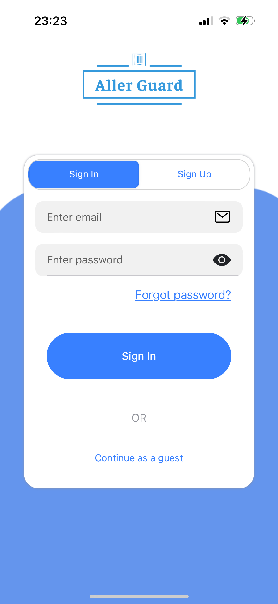 | 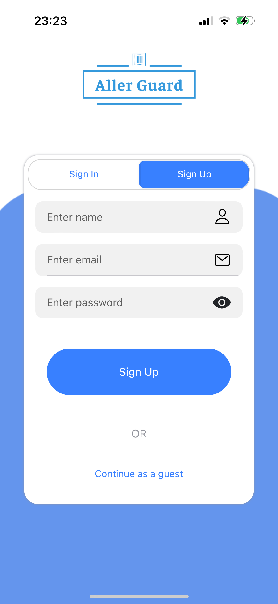 |

---

### **Main Features**
| Barcode Scan | Allergen List | Allergen Details |
|-------------|---------------|------------------|
| 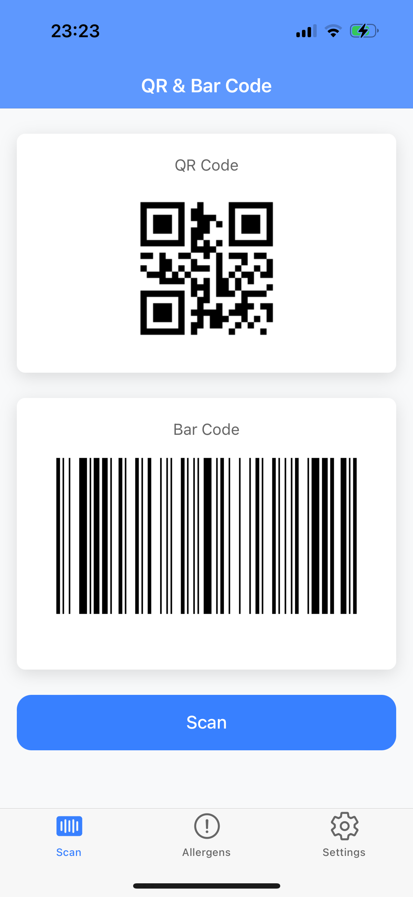 |  | 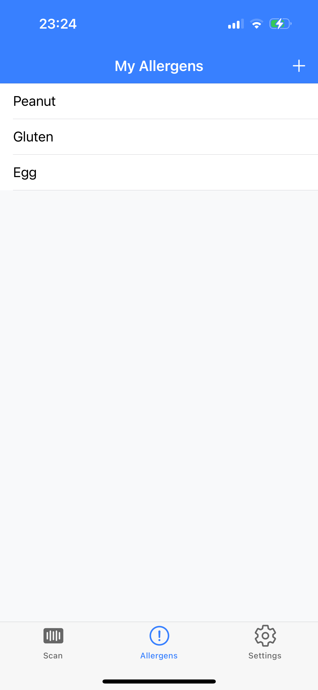 |

---

### **Allergen Warnings**
| Allergen Detected | No Allergen Detected | Add Allergen Without Account |
|-------------------|----------------------|-------------------------------|
| 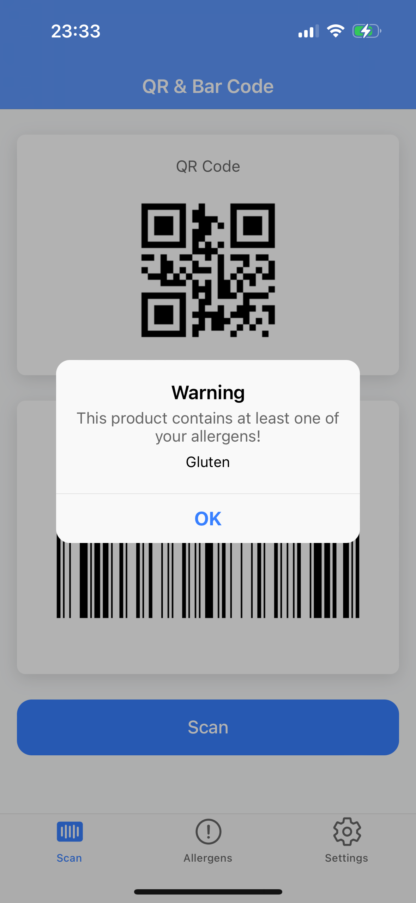 | 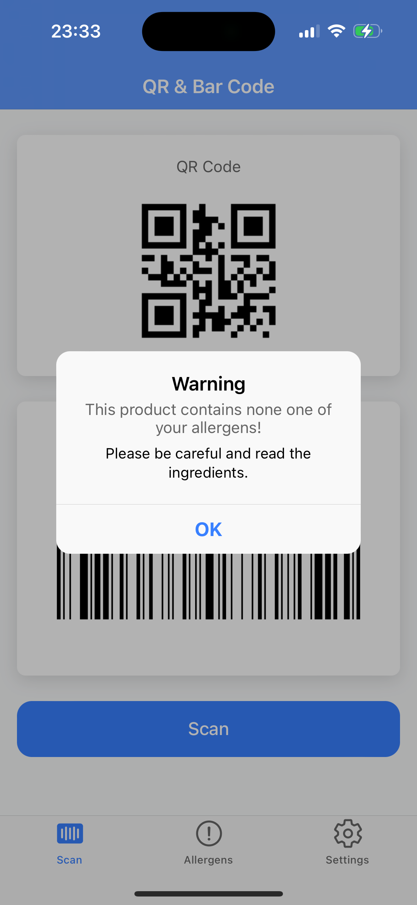 | 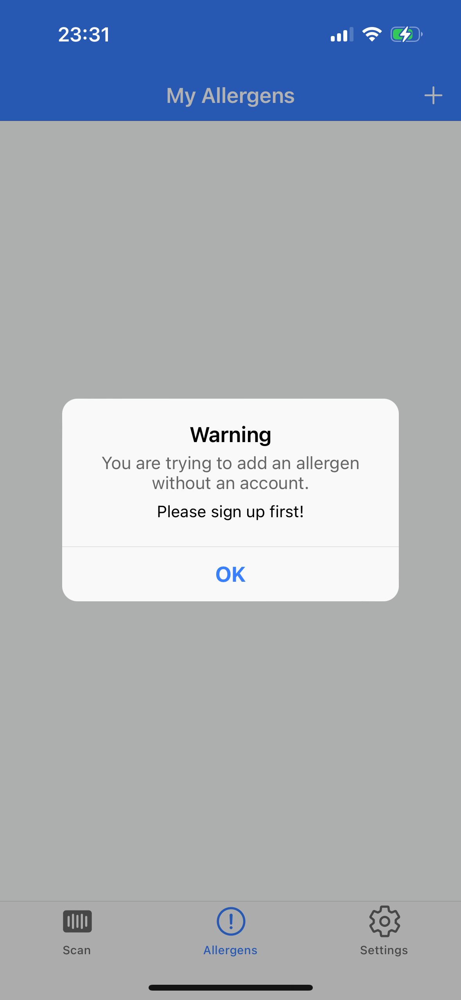 |

---

### **Information & Help Pages**
| News | About Page | FAQ |
|-----|------|------------|
|  | 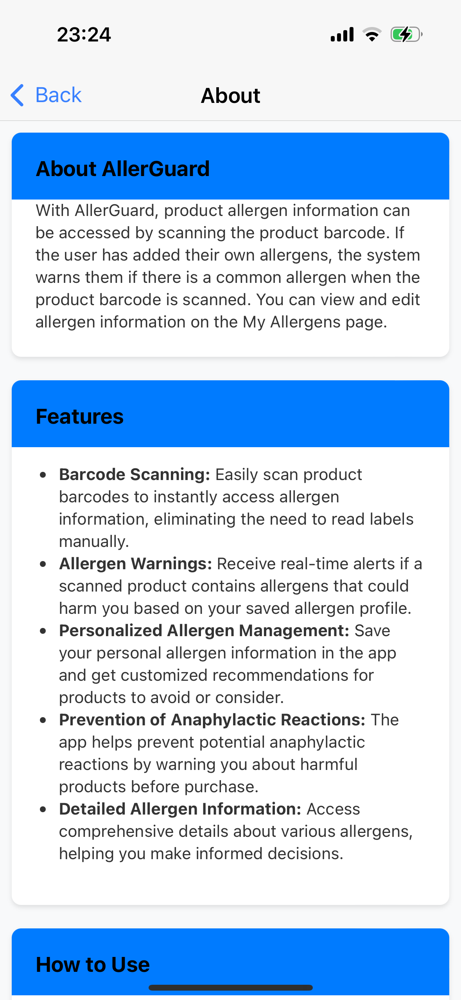 | 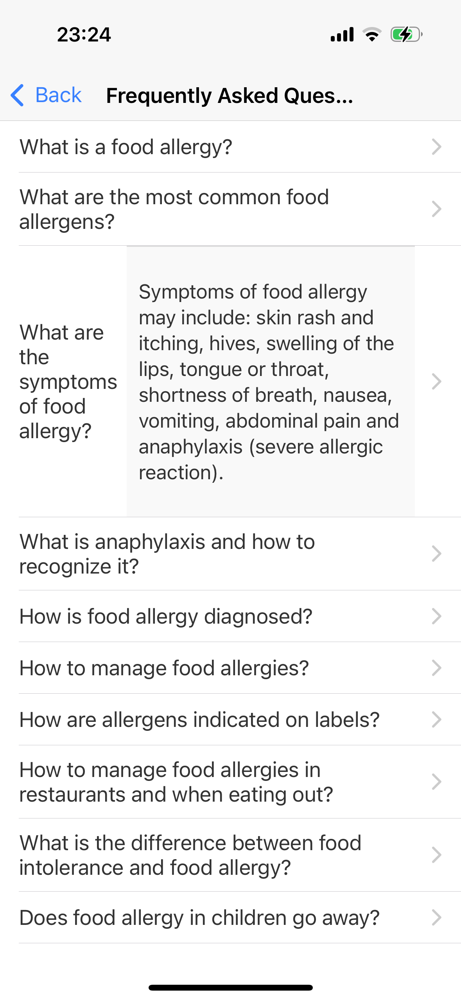 |

| About Page 2 | Settings Page | Settings Page 2 |
|-------------|--------------|-----------------|
| 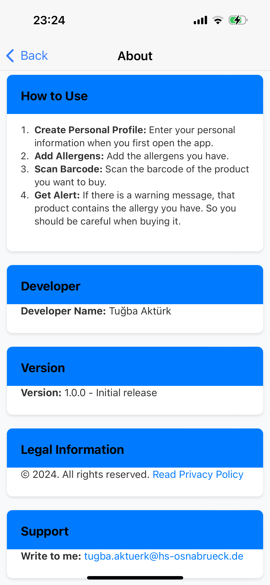 | 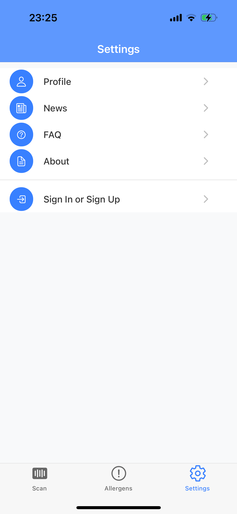 | 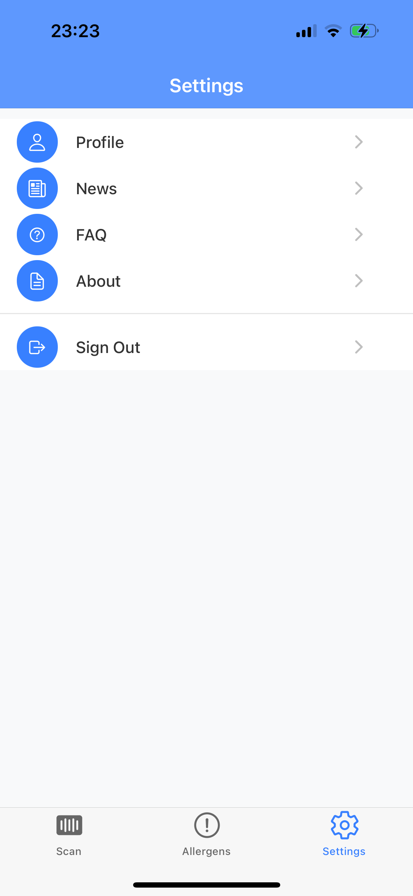 |

---

### **Profile & Other Screens**
| Profile | Sign Out Confirmation |
|--------|------------------------|
| 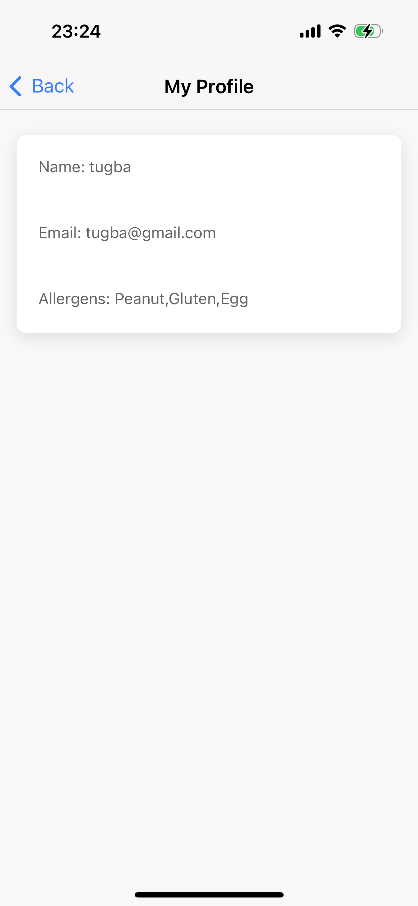 |  |

---

## 🧪 Testing & Security  

### **Testing Approaches**  
- **Functional Tests** → Barcode scanning, allergen detection, profile management  
- **Integration Tests** → Ensure OpenFoodFacts API and Firebase are working together correctly  
- **Performance Tests** → Evaluate response times and database load handling  
- **Usability Tests** → Intuitive UI designed for all age groups  
- **Compatibility Tests** → Works seamlessly on **Android** and **iOS**  

---

### **Security Measures**  
- **Firebase Authentication** with session management  
- **Firestore Security Rules** for controlled data access  
- **Data Encryption** during storage and transmission  
- **Regular Vulnerability Scans** for improved safety  
- **No Sensitive Information Stored Locally**  

---

## 📧 Contact  

**Developer:** Tuğba Aktürk  
**Email:** [tugba.aktuerk@hs-osnabrueck.de](mailto:tugba.aktuerk@hs-osnabrueck.de)  

---
